

<!-- HERO: local animated HUD background plus approved Typing SVG service. -->

 

<h1>J.A.R.V.I.S. // MANISH SHAW</h1>

  

<!-- CORE HUD: three-column system layout using only local SVG modules. -->
<table>
  <tr>
    <td width="33%" align="center">
      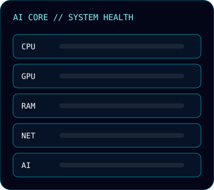
       
      
    </td>
    <td width="34%" align="center">
      
       
      <strong>AI CORE</strong>
       
      Autonomous build systems, intelligent tooling, full-stack telemetry.
    </td>
    <td width="33%" align="center">
      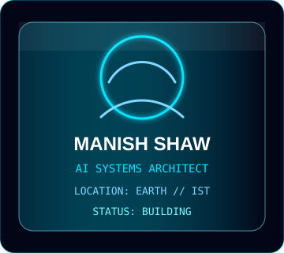
       
      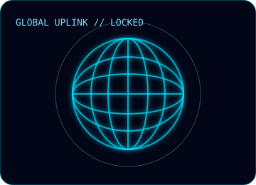
    </td>
  </tr>
</table>


<!-- MISSION: reusable local panel art paired with profile copy. -->
## Mission Control

<table>
  <tr>
    <td width="50%">
      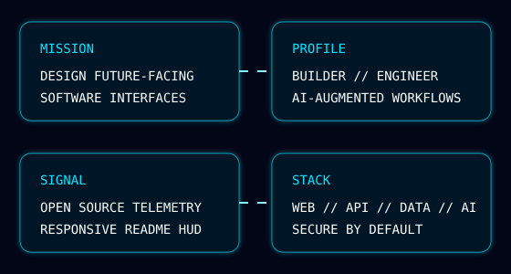
    </td>
    <td width="50%">
      <h3>Current Directives</h3>
      

        Build clean, practical systems with a cinematic edge. I work across AI-assisted developer tooling,
        web platforms, automation, APIs, and data-aware interfaces.
      

      

        The workshop is tuned for fast experiments, polished user experience, and code that can survive
        contact with the real world.
      

    </td>
  </tr>
</table>

<!-- STACK: local SVG icons, no external badge services. -->
## Tech Stack

<table>
  <tr>
    <td align="center"> <strong>AI</strong> Agents, prompts, RAG</td>
    <td align="center">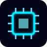 <strong>Systems</strong> Node, Python, APIs</td>
    <td align="center"> <strong>Data</strong> SQL, analytics, pipelines</td>
    <td align="center"> <strong>Network</strong> Cloud, integrations</td>
    <td align="center"> <strong>Security</strong> Auth, hardening, reviews</td>
  </tr>
</table>

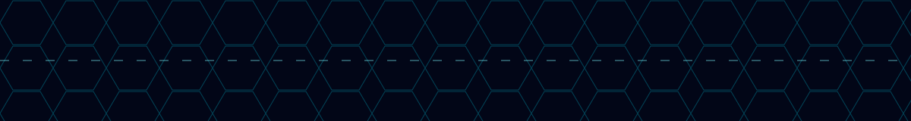

<!-- TELEMETRY: approved external GitHub stat services only. -->
## GitHub Telemetry

 

 

## Featured Projects

<table>
  <tr>
    <td width="50%">
      <h3>Project: Stark Console</h3>
      
AI-powered command surface for developer workflows, diagnostics, and automation.

      
<code>AI</code> <code>CLI</code> <code>Automation</code>

    </td>
    <td width="50%">
      <h3>Project: Reactor UI</h3>
      
Reusable neon HUD components for dashboards, monitoring views, and technical portfolios.

      
<code>Frontend</code> <code>SVG</code> <code>Design Systems</code>

    </td>
  </tr>
  <tr>
    <td width="50%">
      <h3>Project: Sentinel API</h3>
      
Secure API layer with authentication, observability, rate limiting, and clean contracts.

      
<code>Backend</code> <code>Security</code> <code>Cloud</code>

    </td>
    <td width="50%">
      <h3>Project: Data Forge</h3>
      
Data processing toolkit for transforming raw events into operational intelligence.

      
<code>Data</code> <code>ETL</code> <code>Analytics</code>

    </td>
  </tr>
</table>

<!-- CONTACT: plain links keep the README GitHub-safe and dependency-light. -->
## Contact Uplink

<strong><a href="mailto:manishshaw301106@gmail.com">EMAIL UPLINK</a></strong>
&nbsp;&nbsp;|&nbsp;&nbsp;
<strong><a href="https://github.com/manishshaw301106">GITHUB NODE</a></strong>

  

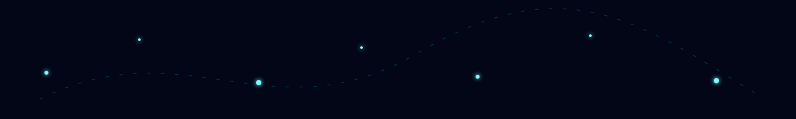

JARVIS PROFILE OS // LOCAL ASSETS ONLINE // README-COMPATIBLE // NO JAVASCRIPT

